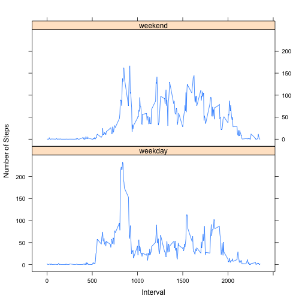

# Activity Data Assignment

Loading data and remove NA 


```r
data <- read.csv("activity.csv")
data.steps <- data[complete.cases(data), ]
```

Total number of steps taken per day


```r
total.steps <- tapply(data.steps$steps, data.steps$date, sum, na.rm = TRUE)
```

Plot the histogram


```r
hist(total.steps, col = "blue", main = "Total steps per day", xlab = "Steps", ylab = "Frequency")
```


Calculate and report the mean and median of the total number of steps taken per day


```r
mean(total.steps, na.rm = TRUE)
```

```
## [1] 10766.19
```


```r
median(total.steps, na.rm = TRUE)
```

```
## [1] 10765
```
Make a time series plot 


```r
interval.steps <- tapply(data$steps, data$interval, mean, na.rm = TRUE)
plot(interval.steps, type = "l", col = "green", main = "Average daily activity", ylab = "Average steps", xlab = "5-min interval")
```


5-min interval with maximum number of steps


```r
seq(along = interval.steps) [interval.steps == max(interval.steps)]
```

```
## [1] 104
```

Calculate and report the total number of missing values in the dataset


```r
sum(is.na(data$steps))
```

```
## [1] 2304
```

Replace NA with the mean value of its 5-minute interval and create a new dataset


```r
interval.mean <- as.data.frame(interval.steps)
dataset2 = merge(data, interval.mean, by.x="interval", by.y = "row.names")
dataset2$steps[is.na(dataset2$steps)] = dataset2$interval.steps[is.na(dataset2$steps)]
dataset2$date <- as.Date(dataset2$date,"%Y-%m-%d")
dataset2$interval.steps = NULL
```

Make a histogram


```r
date.group <- factor(data$date)
total.steps2 <- tapply (dataset2$steps, date.group, sum)
hist(total.steps2, xlab="Total steps by day",ylab="Frequency",main="Number of daily steps", breaks = 20, col = "red")
```


Calculate and report the mean and median total number of steps taken per day


```r
mean(total.steps2, na.rm = TRUE)
```

```
## [1] 10766.19
```


```r
median(total.steps2, na.rm = TRUE)
```

```
## [1] 10351.62
```

Mean value are the same and there is a little difference beetwen median's values.

Create a new factor variable 


```r
dataset2$wDay <- factor(weekdays(dataset2$date))
levels(dataset2$wDay)
```

```
## [1] "Friday"    "Monday"    "Saturday"  "Sunday"    "Thursday"  "Tuesday"  
## [7] "Wednesday"
```

```r
levels(dataset2$wDay) <- list(weekday = c("Moday", "Tuesday", "Wednesday", "Thursday", "Friday"), weekend = c("Saturday", "Sunday"))
```

Make a panel plot


```r
library(lattice)
steps.mean <- aggregate(dataset2$steps, list(as.numeric(dataset2$interval), dataset2$wDay), FUN = "mean")
names(steps.mean) <- c("interval", "weekdays", "stepsavg")
xyplot(steps.mean$stepsavg ~ steps.mean$interval | steps.mean$weekdays, layout = c(1, 2), type = "l", xlab = "Interval", ylab = "Number of Steps")
```




                        

